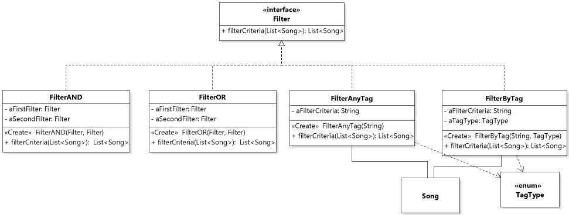

## Contributions

#### Requirement 4:

- Initially implemented Zachary’s original idea for Requirement 4. However, I found this solution to be a bit clumsy as it did not allow different filtering algorithms and was not particularly good design. 
- I then decided to redesign the code to have an anonymous class for every sort of filtering, i.e. to filter by title, artist, time, genre, BPM, composer. 
- Ujjwal took this code and transformed it into multiple function objects, an equally valid solution. He also introduced FilterAND and FilterOR classes to allow the user to specify sorting algorithms, as per assignment instructions
- I then simplified this code so that instead of having many repetitive classes for title, artist, time, genre, BPM and composer, the client specified which kind of tag they want to search for. This class is named FilterByTag. To specify the tag, I put the tags together in an enum, which was a more convenient solution. I created another class named FilterAnyTag, which looks through all tags, including custom tags, for a match with the specified filtering query. Therefore, the client can choose to filter directly for a specific item, such as a song title, or can have a more general search for “2020”, which would filter all songs which have a tag of any sort with “2020” in it. 
- Multiple test cases in the Client class to ensure proper functionality.

#### Requirement 6:
- I created one of the generatePlaylist methods in the Library class, partially fulfilling Requirement 6. This method uses the filters created for Requirement 4 to generate a Playlist with the songs filtered by passing a Filter object as a parameter to the generatePlaylist method.

## Design Decisions

