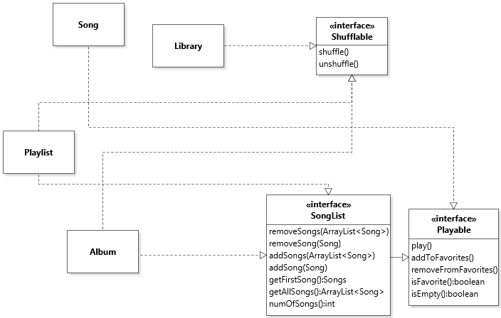
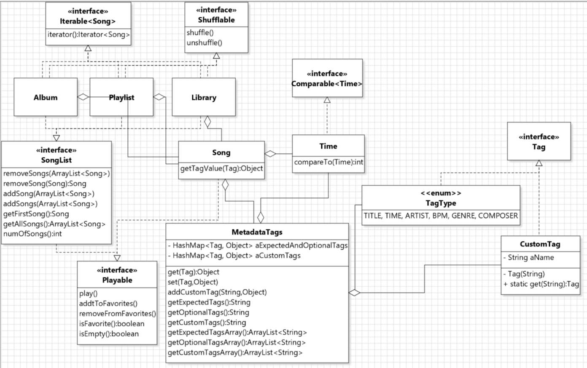

## Contributions
- I primarily worked on Requirement-3, with a few overlaps with Req-1 and 4. With a lot of discussion going into Requirement-3 and some discussion for other requirements. 
- Built up on initial proposition put forth by Meagan, and improved it by extending interfaces and distributing methods to reduce the number of interfaces. Also extended some functionalities to the library class.  
- Pointed flaws in the Library and Album class, with an increased focus on reducing the number of leaks. 
- Fixed errors carried from the previous version of the Assignment. Under discussion (For category Activity- 2 and for the category Design- 2c,d and 4.)
- Wrote design decision and reasonings for Requirement-3 along with approporaite UML diagrams for Requirement-3 and reflection on the overall design.
- Created following interfaces - `Shufflable`, `Playable` and made changes to `SongList` interface, which contains the methods `removeSongs(ArrayList<Song>), removeSong(Song):Song, addSong(ArrayList<Song>), addSongs(ArrayList<Song>), getSong():Song, getAllSongs():ArrayList<Song>, numOfSongs():int` for the implemented classes. 
- For the Playable interface implemented `addToFavorites()`, `removeFromFavorites()`, `isFavorite()`,`play()`,and `isEmpty():boolean` in the Album, Song and Playlist classes. 
- Implemented the `shuffle()` and `unshuffle()` for the ALbum, Playlist and Library classes. 
- Additionally, implemented `findSongsByFavorite()`, `findAlbumsByFavorite()`and `findPlaylistsByFavorite()` in the library class fetch a list of favorites (for songs/albums/playlists) acting on a library. 
- Wrote test cases in client code for testing all methods and implementations used in Requirement-3

## Designs

