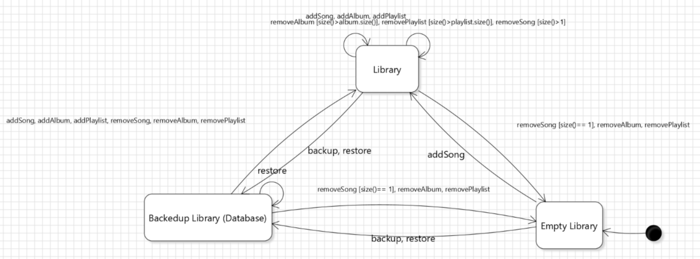
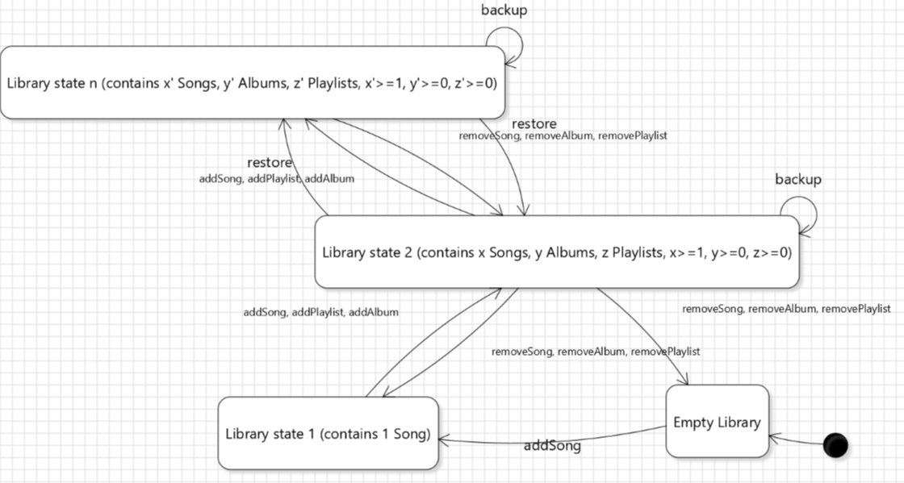
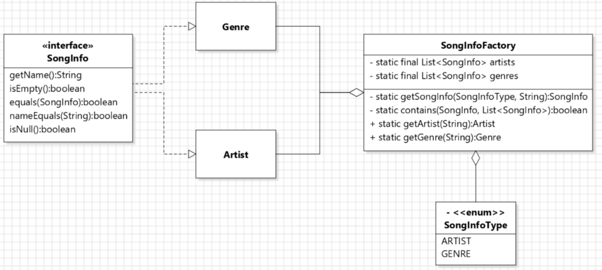

## Contributions
- I commited all my work to `malinda-branch`. And used `yixin` branch for a temporary commit when resolving conflicts.

### Implementer for Task 3: Library lifecycle
- My state diagram for Library:

- Implemented all methods in Library. 
- At start state, the Library is empty (state at the lower right).
- After any of `addSong(Song), addAlbum(Album), addPlaylist(Playlist)`, Library becomes `!isEmpty()` (state at the top).
- After any of `removeSong(Song), removeAlbum(Album), removePlaylist(Playlist)`, Library can become empty or not empty depending on whether there are more songs left after the operation.
- `backup(), restore()` makes the Library interact with the Database (methods in Database not implemented, just placeholder methods), and makes the Library `isBackedUp()`. Any other add/remove operations make the Library `!isBackedUp()`.
- Library contains a `static final Library INSTANCE`, so the constructor is private, all methods are public static factory methods, and all operations are done to `INSTANCE`.
- In `addAlbum(), addPlaylist()`, all songs the album/playlist contains are also added to the Library. (unable to add if the Library contains no song)
- In `removeAlbum(Album, boolean), removePlaylist(Playlist, boolean)`, the user can specify using the boolean whether to also remove all songs the album/playlist contains from the Library or not.
- The state diagram can also be more detailed like this: state 2 and state n are examples of Library states containing different Songs/Albums/Playlists.

`restore()` makes state transition to the previously backed-up state.

I also implemented the test codes for taska 2 and 3 in Client class.`print(), addSong(), removeSong(), getSongs()` methods in Library, Album, Playlist. Constructors, getters, and `copy()` method in Song. Design by contract in a lot of methods, and javadoc comments in a lot of methods.

### Reviewer for Task 2: Unique Artists and Genres
- My class diagram for this task:

- Artist and Genre implement SongInfo interface, constructors of Artist and Genre are protected so that Client can't access them directly. The flyweight design is implemented in `SongInfoFactory`, which contains static factory methods `getArtist(String), getGenre(String)`, with other private attributes, methods, and enum for avoiding duplicates. Artists and Genres are stored in private Lists to check whether they already exist. Methods `getSongInfo(), contains()` and enum `SongInfoType` are implemented to be general methods, so that it's flexible to add other SongInfo in addition to Artist and Genre. (These methods in SongInfoFactory can be translated into Artist and Genre classes to achieve the same purpose, but that way we will have a lot of code replication and it will not be flexible when we add another `SongInfo`).
- In `SongInfo` interface, a static `NULL` object is initialized, to be used for null object design pattern in `Song` class. `nameEquals()` compares the name to an input String, this is used in `SongInfoFactory.contains()`, in this way we don't need to create a new Artist/Genre object to compare whether it exists or not in the list.

### Discussant for Task 1: Supporting Partial Information in Song and Album
- We implemented `Optional` types for fields in Song: `Optional<String> aTitle, Optional<Integer> aDuration, Map<String, Optional<String>> aTags`, and used `Optional.ofNullable()` to initialize these fields in a constructor, so that we don't need to use design by contract and assert the inputs are not null. 
- We used NULL object design pattern for Artist and Genre: initialize them using `SongInfo.NULL`. Since we can't cast `SongInfo.NULL` into Artist or Genre, the type in the fields for aArtist and aGenre are SongInfo.
- I implemented the `copy()` method in Song for making deep copies in `getSongs()` in Library, Playlist, Album. A new Song object is constructed using just the aFile, and other fields are set using the setters. Instead of using design by contract (precondition and assert), `setArtist(Artist), setGenre(Genre)` can take null as input to set the Artist and Genre to `SongInfo.NULL`. This is used in `copy()` in the case that this Song has NULL Artist or Genre.
- I implemented getters in Song: `getTitle(), getDuration()` returns the object if the Optional object exists, else returns null. These methods are also used in `copy()`.

(I copied my task2 and task3 descriptions into [design-decisions](../design-decisions.md)
