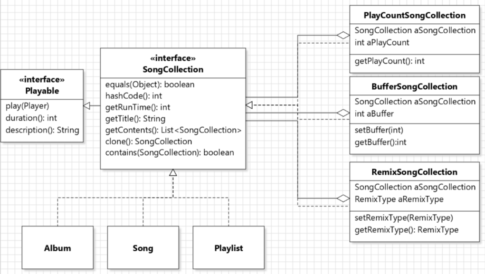
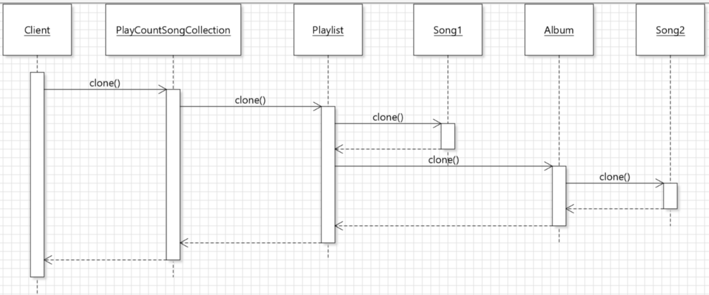

## Contributions
- My implementations for problem 2 were in branch [problem_2_malinda](https://gitlab.cs.mcgill.ca/mnassif/303a4t23/-/tree/problem_2_malinda). My tests for problem 1 and other contributions were in branch [problem1_test_malinda](https://gitlab.cs.mcgill.ca/mnassif/303a4t23/-/tree/problem1_test_malinda).

### Implementor for Problem 2: Effects for Playlist Elements
- Issue: [issue-4](https://gitlab.cs.mcgill.ca/mnassif/303a4t23/-/issues/4)
- My class diagram for problem 2: 
- The decorator classes `PlayCountSongCollection, BufferSongCollection, RemixSongCollection` were implemented following a decorator design pattern. (They are a SongCollection themselves, and wrap the SongCollection). They all have a SongCollection as their field, and have effects shown in other methods.
- `PlayCountSongCollection`: counts the number of times the SongCollection is played. It uses an int to count, and it increments every time `description()` is called (it's called in `play()` and in `description()` of any SongCollection that contains `this`). `getPlayCount()` returns the number of times the SongCollection is played.
- `BufferSongCollection`: adds a parameterizable amount of silence (buffering) before and after the SongCollection. It has `setBuffer()` and `getBuffer()` for setting and getting the buffering time. Its `description()` is modified accordingly to show a silence before and after the SongCollection is played.
- `RemixSongCollection`: the SongCollection will be remixed when played. It contains an enum `RemixType` containing available remix types. It has getter and setter to set and get the RemixType. Two of the RemixTypes make the SongCollection's duration longer/shorter. And the RemixType is printed when played (in `description()`).
- My sequence diagram for problem 2 (an example of PlayCountSongCollection calling `clone()`): 
- Most methods from `Playable` and `SongCollection` in the decorator classes call the corresponding methods using `aSongCollection` (it's a `Playlist` in the above sequence diagram).

### Reviewer for Problem 3: Playlist Copying
- Issue: [issue-7](https://gitlab.cs.mcgill.ca/mnassif/303a4t23/-/issues/7)
- When overriding `Object.clone()`, we changed the return type to the type of each class.
- We used `super.clone()`, i.e. `Object.clone()`, to properly create a cloned object reflectively, which creates a shallow copy. Then new fields were assigned to the cloned object. (Because we need to reassign the fields, we can't make fields like `List<SongCollection>` and `Map<Integer, Song>` final like what we did in the previous assignments).
- In addition to the above review, I fixed some errors in the `clone()` methods, and implemented `clone()` method in the decorator classes to call `clone()` on the SongCollection that is contained.

### Tester for Problem 1: Supporting Rich Playlists
- I implemented JUnit test classes `TestPlaylist`, and half of `TestAlbum`. I also implemented the last few methods of `TestSong` (the methods did not pass because my colleague wasn't using reflection correctly, so I implemented the reflective methods and corrected those).
- I used `private final` fields to initialize `Playlist, Song, Album` in the test classes, and used `@BeforeEach` to run some initializing steps so that I didn't have to repeat the step in every method.
- I mostly had one test method for each method in `Playlist, Album, Song` classes. The straightforward methods (for example those that just print something to System.out) were not tested.
- I used reflection to get private fields of the objects, in order to compare with getters, and to access internal states.
- I used assert methods (`assertTrue, assertFalse, assertEquals, assertSame, ...`) to test the correctness of the logic of the methods.
- I used coverage to make sure I cover all branches in the methods.

