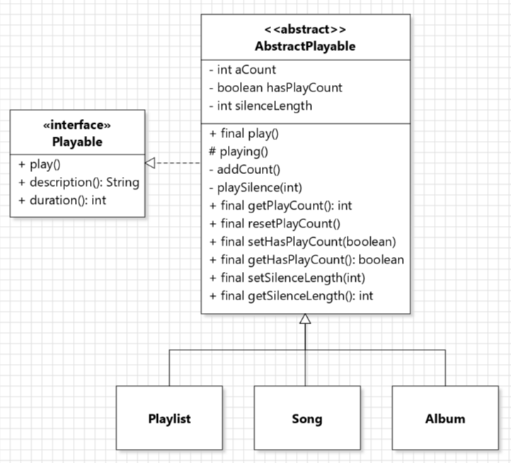
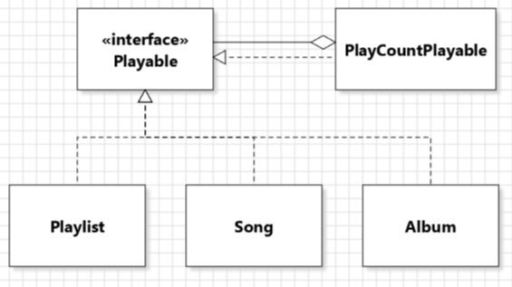
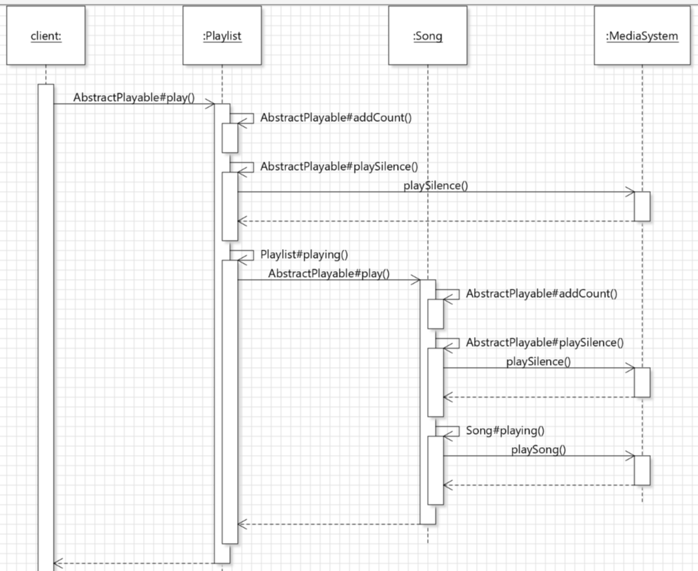

## Contributions
- My implementations for problem 1 and updates for problem 2 were in branch [problem1_Linhui](https://gitlab.cs.mcgill.ca/mnassif/303a5t4/-/tree/problem1_Linhui). My tests for problem 3 and other updates were in branch [test3_Linhui](https://gitlab.cs.mcgill.ca/mnassif/303a5t4/-/tree/test3_Linhui).

### Implementor for Problem 1:
- Discussion in this issue: [issue-5](https://gitlab.cs.mcgill.ca/mnassif/303a5t4/-/issues/5)
- My class diagram for problem 1 and 2 (problem 1 and 2 are both implemented in `AbstractPlayable` abstract class): 
- We first compared approaches to make play count mandatory vs. optional for Playable objects. For mandatory, we should use an abstract class `AbstractPlayable`, which contains the field `aCount` and contains implementations of the methods `addCount(), getPlaCount(): int, resetPlayCount()`, and contains `play()` method which calls `addCount()` to increment `aCount`. The public methods are all `final` so that the subclasses can't override them. Having `AbstractPlayable` also prevents code duplication which may happen if we implement an abstract class for each of `Playlist, Song, Album`.
- For playcount to be optional, we first considered Decorator design pattern like this:  But this way we separate the types of PlayCountPlayable objects and those without play count, which is complicated and redundant compared to the abstract class approach.
So then we decided to put a `boolean hasPlayCount` field in `AbstractPlayable` to keep track of whether this object has play count, we added setters and getters, and modified other methods to incorporate this boolean.

### Reviewer for Problem 2:
- Issue: [issue-10](https://gitlab.cs.mcgill.ca/mnassif/303a5t4/-/issues/10)
- In `AbstractPlayable`, a `public final play()` method is implemented, which contains the 3 steps required for problem 2. First it calls the private method `addCount()` which increments `aCount` if this object `hasPlayCount`. Second it calls the private method `playSilence(int)` to play some silence using MediaSystem (we also implemented getters and setters for silence length). Lastly it calls the protected abstract method `playing()` (protected so it's only accessible in the subclasses), which is implemented in the subclasses to play the contents. This abstract class helps with code reuse.
- My sequence diagram for `play()` for a sample Playlist which contains one Song: 
When `play()` is called on Playlist, `addCount(), playSilence(), and playing()` are called on the object sequentially. The `Playlist#playing()` method then calls `play()` for the Song that it contains, which calls the same 3 methods `addCount(), playSilence(), and playing()` on the Song.

### Tester for Problem 3:
- In `TestProblem3`, we implemented tests for add/remove, and redo/undo of add/remove of Library.
- The code in `@BeforeEach` method is run before each `@Test` method to re-initialize the fields, so that the tests are repeatable in any order and state changes from previous test cases won't impact the result of future test cases.
- We checked the methods are working properly by checking changes of the size of `items_in_lib`, and checking changes of sizes of `command, undone`. The static fields `items_in_lib, command, undone` are `List<Playable>` and `Stack<Command>`, which are fields of Library obtained reflectively in the 3 methods at the bottom of the test class.

