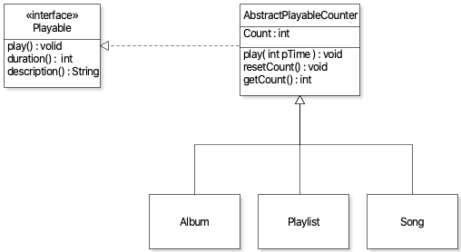
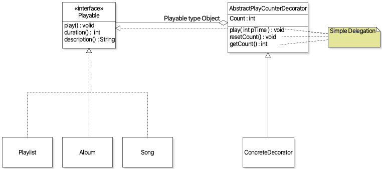

## IMPLEMENTATION
#### Problem 3
Command Design Pattern
(Implemented)
#### First Implementation

First implementation : !1

- `CommandExecutor.java` for managing history of commands of type `Command`. CommandExectur class is the main class the manages the Command undo and redo operatoin. It takes either Command list or single Command type object and execute all/single command plus provides functionality to redo the last added command to the stack. 
- Commands  `ADD` and `REMOVE` in `library`, `Playlist` and `Album`. This way all the add/remove commands in Playlist, Album , Library have feature of redo/undo.
- `hashcode` and `equals` in `Playlist` , `Album` and `Song` for comparision in the list of library to avoid duplicates. 
- `Problem3Client.java` for testing implementation for problem 3.

Second Implementation : !33

- For second implementation reviews were taken into account and all the command executor code was transfered with the help of other implementors. 
- Because problem 3 asked for redo/undo operation just for add/remove operations on library so everyone came to conclusion that it's better to have commandExecutor functionality i.e. stack to store commands and undo command stack, in the library class itself. 
- All the prevous code to redo/undo feature in playlist and album was deleted because it was no longer needed ( not asked for in problem 3 guidelines)
- added new `Problem3Client.java` to test the problem 3 functionality. ( everything works as expected )

Further improvement  to the code : 

- reduced redundant code by deleting redo method in the command interface and just using undo to execute the commands again.  
- introduced design by contract  where ever necessary
- added feature to avoid removing playable if playable not present in library
- added feature to avoid adding Command type object to the Command Stack in the library to avoid invalid Commands in Stack.
- Redo and Undo Features now works perfectly for add/remove methods in the library.

## REVIEW 
### Problem 1
merge requst reviewed : 
 - !20 : regarding test cases for problem 2
 - !25 : regarding problem 3 
 - !19 : regarding test suit for problem 1
 
**discussion**  : #5 for merge request !3 and !2
- Proposed alternative design to avoid duplicate code in our implementation of problem 1. 
- Design 1 : Idea of using Abstract class of type playable to avoid duplicate code when adding play and Count functionality to playable types
- UML Diagram : 

- Design 2 : Assuming that Count functionilty was optional, Proposed an idea for Decorator Design Pattern to add Count Functionality will reduce code reuse and Count Feature can be added as an option ( not mandatory feature)
- - UML Diagram : 

- Both Design Were supported with proper use of UML diagrams + intensive discussion

## TESTING
### Problem 2
- Wrote Test cases for Problem 2 
- Testing file ->  merge request : !12 which was further improved by other teamates. 
- 
**Further Details regarding project discussion are in respective discussion threads.**