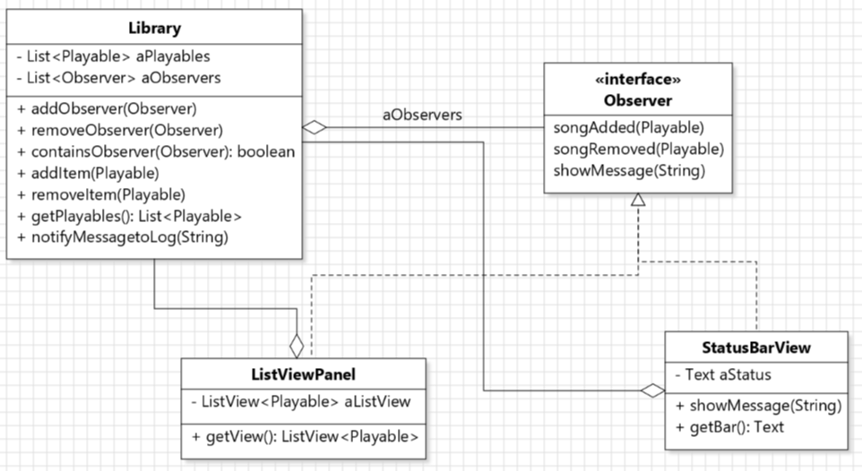
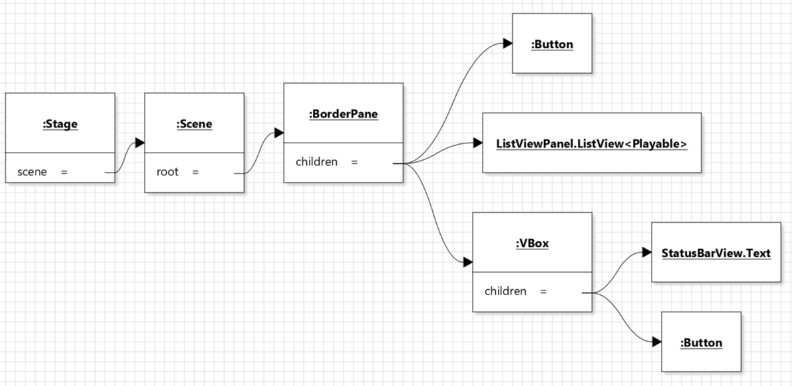

## Contributions
- My implementations are all in branch [problem1_Linhui](https://gitlab.cs.mcgill.ca/mnassif/303a6t6/-/tree/problem1_Linhui)

## Implementer for problem 1:
- I did the initial implementation of `LibraryUI, Library, Observer, ListViewPanel`. (merge request [!2](https://gitlab.cs.mcgill.ca/mnassif/303a6t6/-/merge_requests/2))
- My class diagram: 
- My object diagram for the GUI: 
- Observer design pattern: `ListViewPanel` and `StatusBarView` both implement `Observer` interface. `ListViewPanel` contains `ListView<Playable>` that contains the list of all songs in the Library. `StatusBarView` contains `Text` that shows a message.
- In `LibraryUI`, the GUI is implemented according to the above object diagram. `addButton` and `deleteButton` have anonymous classes of `EventHandler` to handle clicks. 
- The `BorderPane` gets the `ListView<Playable>` through the method `ListViewPanel.getView()`, which is called each time a button is clicked. Similarly, `BorderPane` gets the `Text` through `statusBarView.getBar()` to add the Text to the GUI.
- `Library` keeps a list of Observers, with methods `addObserver(Observer), removeObserver(Observer)` to modify the list of Observers. When `addItem(Playable)` or `removeItem(Playable)` is called, all Observers are notified using `Observer.songAdded(Playable), Observer.songRemoved(Playable)`, where they modify the ListView or Text that they contain.
- All possible exception is handled using try-catch block. When any exception is thrown or any operation is unsuccessful, `Library.notifyMessagetoLog()` is called, which calls `showMessage()` in Observers to print a message in the status bar and in the console. (`showMessage()` is implemented as an empty default method in `Observer`, and is only overriden in `StatusBarView`. Because we access this method from `Library` where `showMessage()` is called on all Observers, we need to make all Observers have `showMessage()` method instead of only implementing it in `StatusBarView`. In this way we don't need to check whether the Observer is actually `StatusBarView` in Library, and it's also helpful for adding more Observers in the future)

## Reviewer for problem 3:
- My review is in issue [#7](https://gitlab.cs.mcgill.ca/mnassif/303a6t6/-/issues/7), I fixed a few things in merge request [!7](https://gitlab.cs.mcgill.ca/mnassif/303a6t6/-/merge_requests/7)
- To make sure to log the same message to the status bar and the console every time, all methods in `StatusBarView` contains both `aStatus.setText()` and `System.out.println()`.

## Tester for problem 2:
- Merge request [!10](https://gitlab.cs.mcgill.ca/mnassif/303a6t6/-/merge_requests/10)
- Fields are re-initialized in `@BeforeEach` so that they are refreshed before every `@Test` method.
- In TestRemove, contents of both `Library` and `ListViewPanel` are checked when Song or Playlist are removed.
- In TestAdd, contents of both `Library` and `ListViewPanel` are checked when Song is added.
- In TestStatus, contents of both `StatusBarView` and what gets printed to console are checked when Song is added / Song is removed / `showMessage()` is called.
