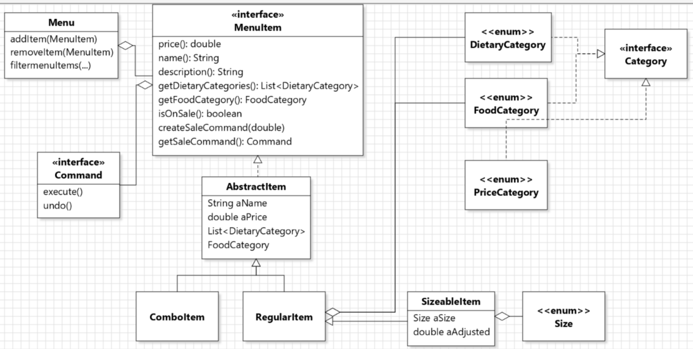

## Contributions
- My implementations of area 3 are in branch [area3_Linhui](https://gitlab.cs.mcgill.ca/mnassif/303a6t6/-/tree/problem1_Linhui). My edits after reviewing area 2 are in branch [area_review_Linhui](https://gitlab.cs.mcgill.ca/mnassif/303a7t21/-/tree/area2_review_Linhui). I implemented tests for area 4 (with Sullan Kang) in branch [area4-tests-lana](https://gitlab.cs.mcgill.ca/mnassif/303a7t21/-/tree/area4-tests-lana).

## Implementer for area 3:
- Issue [#5](https://gitlab.cs.mcgill.ca/mnassif/303a7t21/-/issues/5), merge request [!4](https://gitlab.cs.mcgill.ca/mnassif/303a7t21/-/merge_requests/4)
- I implemented the "Add non-combo item" button and the "Removeitem" button of the GUI.
- For "Add non-combo item" button, a dialog window (a new stage) pops up which contains `ComboBox, CheckBox, TextField` to get mandatory and optional informations of the food item (`RegularItem` or `SizeableItem` depending on the options chosen) and a `Button` which calls `Menu.addItem()`.
- I wrote a private `getSelected()` method to get the selected item on the ListViews of "left, center, right" `MenuViewPanel`. The "Removeitem" button removes the selected item by calling `Menu.removeItem()`.
- I used lambda expression for `Button.setOnAction()` instead of an anonymous class.
- I wrote a public static factory method `updateView()` in `MenuDisplay` which gets VBox containing the ListViews of "left, center, right" `MenuViewPanel`, according to what categories are selected on the ToggleGroup. `updateView()` is called when any change happens to the ToggleGroup, and called in `Menu.addItem(), Menu.removeItem()` so that any change is displayed on the GUI.
- In `MenuViewPanel`, I wrote a enum field `DisplayOrder` to choose to sort the ListViews by alphabetical order or description or by price. And I used a combination of Comparators in `createPanel()` to sort the `List<MenuItem>` before adding them to the ListView. 

## Reviewer for area 2:
- Issue [#6](https://gitlab.cs.mcgill.ca/mnassif/303a7t21/-/issues/6), merge request [!7](https://gitlab.cs.mcgill.ca/mnassif/303a7t21/-/merge_requests/7)
- My class diagram: (updated from the one in the issue) 
- I implemented `equals()` of `RegularItem, SizeableItem, ComboItem` so that no duplicates can be added.

## Tester for area 4:
- Merge request [!8](https://gitlab.cs.mcgill.ca/mnassif/303a7t21/-/merge_requests/8)
- In `TestConfigurations`, I implemented the `@BeforeEach` method to re-initialize the field before running each `@Test` method. I implemented a few `@Test` methods and the `private static` methods which use reflection to get fields in `Configurations`. By checking the coverage, `TestConfigurations` covers most edge cases of `Configurations`, and all cases which `Configurations` is used in `MenuDisplay`.
- I also fixed `TestDisplay`: for Windows, we need to use `\r\n` when checking equality of a string to string printed by `System.out.println`, but for Mac we need to use `\n`, so we just checked equality of each line separately for most of the methods. For `test_addMultipleItems()`, it passes on Windows; on Mac, need to change `\r\n` to `\n` to pass.
